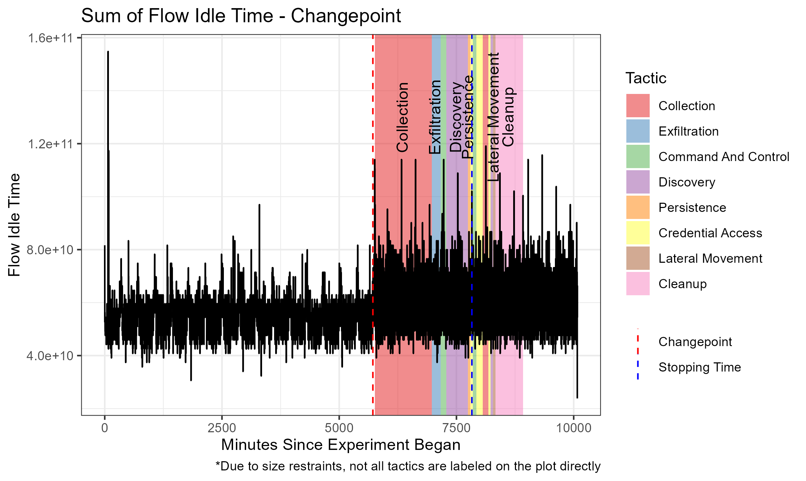
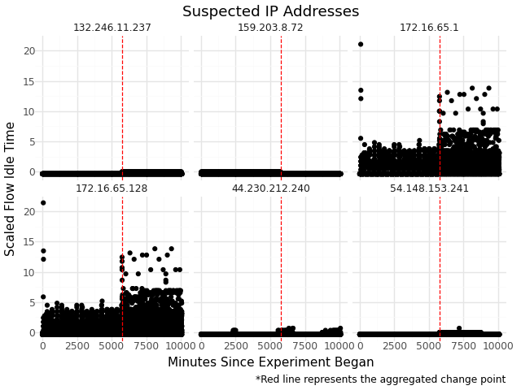

# data-dudes
This repository is for the "Data Dudes" submission to the Cyber Wise Data Science Competition at Texas A&amp;M

# The Data
The data set that we are working with consists of a simulated APT attack from 2024 run by the canada cybersecurity institute and can be obtained [HERE](https://www.unb.ca/cic/datasets/iiot-dataset-2024.html)

The first phase of the experiment consists of network log data that is 100% benign, and the attack begins during the second phase. The goal of our analysis was to create a model that can identify when the attacks begin using a changepoint detection. Our assumption is that once attackers have access to the system, there will be different interactions than there usually are and we hope to be able to detect that change.

Each row in the dataset represents a packet sent from one IP address to another. By leveraging the relationship between the different IIoT devices as well as the different variables obtained from the network log, we hope to find a difference between the benign and the packets.

Once it is identified that there is an attack, we have a model that will determine what type of attack it is so that the attacker can be removed from the system.

# Methodology
As discussed in the previous section, we decided to utilize online changepoint detection to better reflect real-world scenarios in which live network traffic logs are accessible. We considered changepoint detection methods to be a robust approach for identifying unforeseen anomalies, which traditional classification models may fail to detect. Consequently, our task was to identify the online changepoint method most appropriate for our dataset.

The CUSUM (Cumulative Sum) algorithm, introduced by [Page in 1954](http://www.jstor.org/stable/2333009), is one of the most widely utilized alogrithm for online changepoint. It detects changes by calculating the cumulative sum of deviations from a reference value, typically under the assumption that the distributions before and after the changepoint are known. This requirement for prior knowledge of both pre-change and post-change distributions posed a significant limitation for our setting, where the nature of anomalies is unpredictable. Therefore, most methods derived from CUSUM were not suitable for our application.

We also examined Bayesian Online Changepoint Detection (BOCPD), proposed by [Adams and MacKay in 2007](https://arxiv.org/abs/0710.3742), which treats changepoints probabilistically by introducing a hazard function that models the probability that a changepoint occurs at a given time. However, the original BOCPD framework assumes a constant hazard rate, which may not align well with the nonstationary behavior of cyberattacks, where the likelihood of changes can vary over time. 

This led us to consider non-parametric methods, which estimate distributional changes without relying on strong parametric assumptions. These methods often utilize empirical cumulative distribution functions (CDFs) to detect distributional shifts. For instance, the [Non-Parametric UNbounded Changepoint (NUNC)](https://arxiv.org/abs/0710.3742) detection method focuses on identifying changepoints within a sliding window using rank-based or empirical measures. However, its sensitivity to hyperparameters, such as the window size, was an issue especially when we have small prior knowledge about the data.

## NP-FOCuS

Romano developed [NP-FOCus (NPF)](http://dx.doi.org/10.1109/TSP.2023.3343550) with an only assumption that the observations were iid. However, within the literature, the algorithm proved to be effective even with the violation of the iid assumption. Contrary to NUNC, NPF relies on pruning sequences of data stream based on its likeihood generated by the binomial distribution from the empirical CDFs. 

Without getting into technical details of NPF's algorithm. The main idea is to represent the Likelihood ratio test statistic to be functional with respect to $\theta$ and find the value that maximize the functional representation of likelihood ratio test statistic. In short, we are finding the maximum of the maximum. 

# Modeling and Analysis

## Aggregated Changepoint

The most important variable that we found was the flow idle time, and it is easy to see visually why. In this plot, we take the sum of the flow idle time for each minute in the experiment. This provides a constant distribution that changes once the attacks begin in phase 2. The change is clear and our goal was to build a model that could detect the change.

Our final model was able to detect a changepoint at time 5718 represented by the dashed red line in \ref{fig:labels}. The "stopping time" is the moment that the model was able to detect the changepoint and it is referenced in \ref{fig:labels} as a blue dashed line. Our model "stopping time" was time 7829. 

Ideally, the changepoint should be detected as soon as possible. We decided to use an online changepoint method in order to simulate a real life scenario as closely as possible. The implication is that every minute that the changepoint is not detected is another minute that the malicious user has access to the system. We were able to detect the change before a lot of the damage was done; however, the sooner that we can detect the change, the better.

The next step in the analysis is to determine the source of the malicious activity. Our goal is to determine what caused the changepoint to occur. In order to achieve this, we subsetted the data by whether or not the interaction included a specific IP address, and then we used the same online change point detection algorithm (NP-FOCus) to determine which IP Addresses contained the source of the variation.

The detection algorithm would create a flag for each changepoint detected in each of the IP Address subsets. The moment that a changepoint is detected in the aggregated data, the IP addresses that had the closest detected changepoints were observed and plotted to determine which of them was the cause of the aggregated changepoint. As can be seen from the figure above, the IP Addresses 172.16.65.1 and 172.16.65.128 are highly likely to be malicious and have been identified as the cause of the aggregated changepoint.

